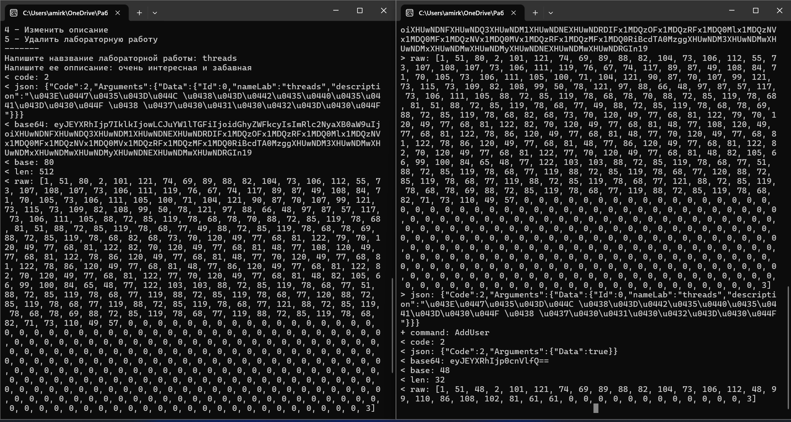
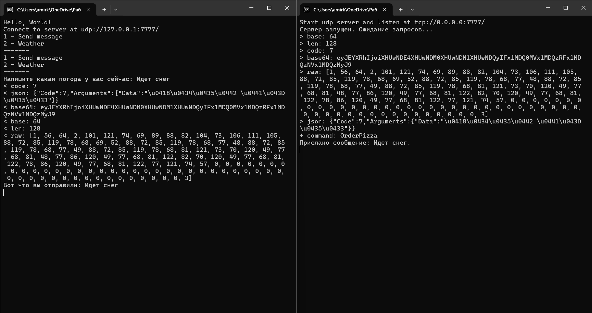

Этот код представляет собой консольное приложение на C#, которое взаимодействует с сервером по сети. Оно позволяет управлять лабораторными работами (добавлять, удалять, обновлять, просматривать) через TCP-соединение и отправлять сообщения через UDP-соединение. Вот объяснение кода:

---

### **Основной функционал**

1. **TCP-клиент для управления лабораторными работами:**
   - Приложение подключается к серверу по указанному адресу (например, `tcp://127.0.0.1:5555`).
   - Пользователь может выполнять следующие действия через меню:
     - Просмотреть все лабораторные работы.
     - Просмотреть лабораторную работу по ID.
     - Добавить новую лабораторную работу.
     - Обновить описание лабораторной работы.
     - Удалить лабораторную работу.

2. **UDP-клиент для отправки сообщений:**
   - Приложение подключается к серверу по другому адресу (например, `udp://127.0.0.1:7777`).
   - Пользователь может отправлять сообщения и указывать погоду.

---

### **Основные классы и их функции**

#### 1. **`Program` (TCP-клиент)**
   - **`Main` метод:**
     - Устанавливает соединение с сервером по TCP.
     - Создает объект `UserApiClient` для взаимодействия с API сервера.
     - Вызывает метод `ManageUsers` для управления лабораторными работами.
   - **`ManageUsers` метод:**
     - Выводит меню и обрабатывает ввод пользователя.
     - В зависимости от выбранного пункта меню, выполняет соответствующие действия (например, получение, добавление, обновление или удаление лабораторных работ).

#### 2. **`UserApiClient`**
   - Реализует интерфейс `IUserApi` для взаимодействия с сервером.
   - Содержит методы для выполнения CRUD-операций (Create, Read, Update, Delete) с лабораторными работами:
     - `GetAllAsync`: Получить все лабораторные работы.
     - `GetAsync`: Получить лабораторную работу по ID.
     - `AddAsync`: Добавить новую лабораторную работу.
     - `UpdateAsync`: Обновить лабораторную работу.
     - `DeleteAsync`: Удалить лабораторную работу.

#### 3. **`NetTcpClient`**
   - Реализует TCP-клиент для отправки команд на сервер.
   - Подключается к серверу по указанному IP-адресу и порту.
   - Метод `SendAsync` отправляет команду на сервер и возвращает ответ.

#### 4. **`Program` (UDP-клиент)**
   - **`Main` метод:**
     - Устанавливает соединение с сервером по UDP.
     - Создает объект `MessageApiClient` для отправки сообщений.
     - Вызывает метод `ManageMessages` для управления сообщениями.
   - **`ManageMessages` метод:**
     - Выводит меню и обрабатывает ввод пользователя.
     - Позволяет отправлять сообщения и указывать погоду.

#### 5. **`MessageApiClient`**
   - Реализует интерфейс `IMessageApi` для отправки сообщений через UDP.
   - Содержит методы:
     - `SendMessage`: Отправить сообщение.
     - `WriteWeather`: Отправить погоду.

#### 6. **`NetUdpClient`**
   - Реализует UDP-клиент для отправки команд на сервер.
   - Подключается к серверу по указанному IP-адресу и порту.
   - Метод `SendAsync` отправляет команду на сервер.

---

### **Как это работает**

1. **TCP-клиент:**
   - Пользователь подключается к серверу по TCP.
   - Выбирает действие из меню (например, просмотр всех лабораторных работ).
   - Клиент отправляет команду на сервер через `NetTcpClient`.
   - Сервер обрабатывает команду и возвращает результат.
   - Клиент отображает результат пользователю.

2. **UDP-клиент:**
   - Пользователь подключается к серверу по UDP.
   - Выбирает действие из меню (например, отправить сообщение).
   - Клиент отправляет команду на сервер через `NetUdpClient`.
   - Сервер обрабатывает команду, но ответ не возвращается (UDP не гарантирует доставку и получение ответа).

---

### **Заключение**

Этот код демонстрирует взаимодействие клиента с сервером по двум протоколам: TCP и UDP. Он позволяет управлять лабораторными работами через TCP и отправлять сообщения через UDP. Код структурирован, чтобы быть расширяемым и поддерживаемым.

### **Демонстрация работы**
#### TCP

#### UDP

