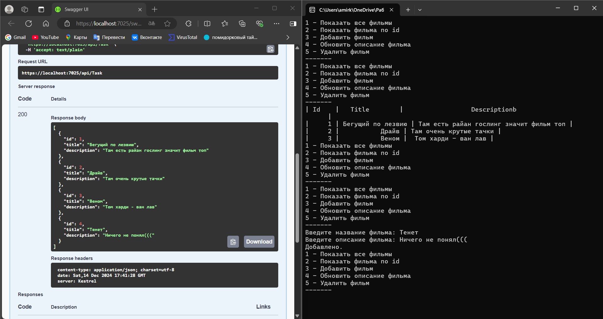

Этот проект представляет собой консольное приложение на C#, которое взаимодействует с API для управления списком фильмов. Приложение использует HTTP-клиент для выполнения CRUD-операций (Create, Read, Update, Delete) через HTTP-запросы. Вот подробное объяснение кода:

---

### **Основной функционал**

1. **Управление задачами (или фильмами):**
   - Приложение подключается к REST API по указанному адресу (например, `http://localhost:5214/api/`).
   - Пользователь может выполнять следующие действия через меню:
     - Просмотреть все фильмы.
     - Просмотреть задачу фильм по ID.
     - Добавить новую задачу фильм.
     - Обновить описание фильма.
     - Удалить фильм.

2. **Использование HTTP-клиента:**
   - Для взаимодействия с API используется класс `HttpClient`, который отправляет HTTP-запросы на сервер.
   - Поддерживаются методы:
     - `GET` для получения данных.
     - `POST` для добавления данных.
     - `PUT` для обновления данных.
     - `DELETE` для удаления данных.

---

### **Основные классы и их функции**

#### 1. **`TaskItem`**
   - Представляет сущность фильма.
   - Содержит свойства:
     - `Id`: Уникальный идентификатор фильма.
     - `Title`: Название фильма.
     - `Description`: Описание фильма.

#### 2. **`TaskApiClient`**
   - Реализует интерфейс `ITaskApi` для взаимодействия с REST API.
   - Содержит методы для выполнения CRUD-операций:
     - `GetAllAsync`: Получить все фильмы.
     - `GetAsync`: Получить задачу фильм по ID.
     - `AddAsync`: Добавить новую фильм.
     - `UpdateAsync`: Обновить фильм.
     - `DeleteAsync`: Удалить фильм.

#### 3. **`Program`**
   - **`Main` метод:**
     - Создает экземпляр `HttpClient` с базовым адресом API.
     - Создает объект `TaskApiClient` для взаимодействия с API.
     - Вызывает метод `ManageTasks` для управления задачами (или фильмами).
   - **`ManageTasks` метод:**
     - Выводит меню и обрабатывает ввод пользователя.
     - В зависимости от выбранного пункта меню, выполняет соответствующие действия (например, получение, добавление, обновление или удаление задач/фильмов).

---

### **Как это работает**

1. **Подключение к API:**
   - Приложение использует `HttpClient` для отправки HTTP-запросов на сервер.
   - Базовый адрес API указывается в свойстве `BaseAddress` объекта `HttpClient`.

2. **Меню:**
   - Пользователь видит меню с пунктами:
     - 1: Показать все фильмы.
     - 2: Показать фильм по ID.
     - 3: Добавить фильм.
     - 4: Обновить описание фильма.
     - 5: Удалить фильм.
   - В зависимости от выбора пользователя, приложение выполняет соответствующую операцию.

3. **Обработка запросов:**
   - Для каждой операции используются соответствующие HTTP-методы:
     - `GET` для получения данных.
     - `POST` для добавления данных.
     - `PUT` для обновления данных.
     - `DELETE` для удаления данных.

---

### **Пример использования**

1. **Получение всех фильмов:**
   - Пользователь выбирает "1 - Показать все фильмы".
   - Приложение отправляет GET-запрос на `http://localhost:5214/api/Task`.
   - Сервер возвращает список фильмов.
   - Приложение отображает список в консоли.

2. **Добавление нового фильма:**
   - Пользователь выбирает "3 - Добавить фильм".
   - Вводит название и описание фильма.
   - Приложение отправляет POST-запрос на `http://localhost:5214/api/Task` с данными фильма.
   - Сервер добавляет фильм и возвращает статус успешности операции.
   - Приложение отображает сообщение "Добавлено" или "Ошибка добавления".

3. **Обновление описания фильма:**
   - Пользователь выбирает "4 - Обновить описание фильма".
   - Вводит ID фильма и новое описание.
   - Приложение отправляет PUT-запрос на `http://localhost:5214/api/Task/{id}` с обновленными данными.
   - Сервер обновляет фильм и возвращает статус успешности операции.
   - Приложение отображает сообщение "Обновлено" или "Ошибка обновления".

4. **Удаление фильма:**
   - Пользователь выбирает "5 - Удалить фильм".
   - Вводит ID фильма.
   - Приложение отправляет DELETE-запрос на `http://localhost:5214/api/Task/{id}`.
   - Сервер удаляет фильм и возвращает статус успешности операции.
   - Приложение отображает сообщение "Удалено" или "Ошибка удаления".

---

### Работа программы
